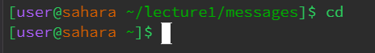
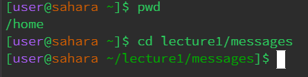
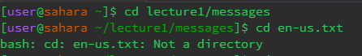
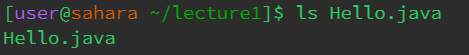
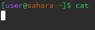
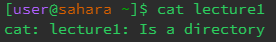
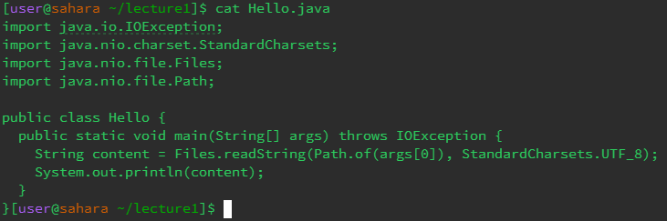

## cd Commands: 

### **No args command**

The working directory was at \lecture1\messages. When cd is used with no argument it takes you back to the home directory. It was not an error.

### **Directory as an argument**

The working directory was in the home directory. When cd is used with a directory as an argument, the directory changes to the given path. It was not an error.

### **Directory as a file** 

The working directory was \lecture1\messages. When cd is used with a file as an argument, the directory does not change. There was an error since cd can only have paths of a folder, not a file. 

## ls Commands: 

### **No args command**

The working directory was at \lecture1. When ls is used with no argument it lists the files and folders in the working directory. It was not an error.

### **Directory as an argument**

The working directory was in the home directory. When ls is used with a directory as an argument, the files and folders in the given directory are listed. It was not an error.

### **Directory as a file** 

The working directory was \lecture1. When ls is used with a file as an argument, the given file is listed. There was no error. 

## cat Commands: 

### **No args command**

The working directory was in the home directory. When cat is used with no argument nothing is displayed and the command line goes down a line. It was not an error, but it does not work nor have any function.

### **Directory as an argument**

The working directory was in the home directory. When cat is used with a directory as an argument, the name of the folder is given along with a description: "Is a directory". It was not an error.

### **Directory as a file** 

The working directory is the home directory. When cat is used with a file as an argument, the elements in the file are displayed. There was no error. 

