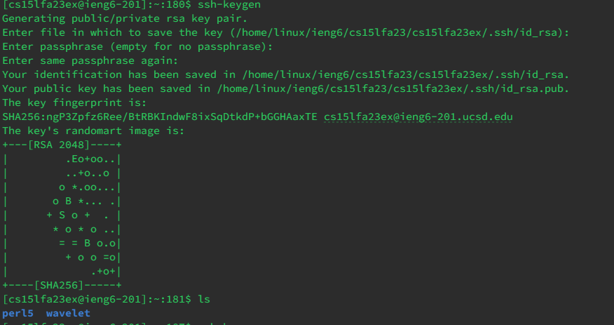

### **StringServer**

### **Output**

**Which methods in your code are called?**
The method called are handleRequest(URI URL). An object of the class Hnadler is made in the same main method causing the method handleRequest to be run.

**What are the relevant arguments to those methods, and the values of any relevant fields of the class?**
URI url is an object that contains the path /add-message and the query s=Hello. runningString is initially an empty  string.

**How do the values of any relevant fields of the class change from this specific request? If no values got changed, explain why.**

**Which methods in your code are called?**
The methods that are called is handleRequest. An object of the class Handler is made in the main method causing the method handleRequest to be run. 

**What are the relevant arguments to those methods, and the values of any relevant fields of the class?**
The arguments relevant to the main method is the port number. For handleRequest, the argument needed is from the Server class which is of type URI. 

**How do the values of any relevant fields of the class change from this specific request? If no values got changed, explain why.**
The only relevant field is the runningString variable. This field changes depending on what the user wants to type into the server.

**In a couple of sentences, describe something you learned from lab in week 2 or 3 that you didn’t know before.**
I learned how to make a secure copy into a server (scp). I also learned how to make a directory using the command line (mkdir). I also learned how to remove a directory using (rm -r).

