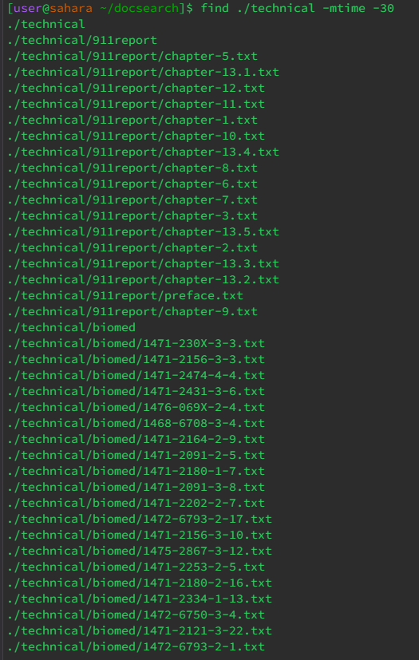

Failure Inducing Input and JUnitTest:

```java
import org.junit.Test;
import static org.junit.Assert.*;
import java.util.NoSuchElementException;

public class LinkedListTest {

    @Test(expected = NoSuchElementException.class)
    public void testFirstOnEmptyList() {
        LinkedList list = new LinkedList();
        list.first(); 
    }
}
```

Input that does not induce a failure and JunitTest:

```java
import org.junit.Test;
import static org.junit.Assert.*;
import java.util.NoSuchElementException;

public class LinkedListTest {
 @Test
    public void testLengthAfterInsertions() {
        LinkedList list = new LinkedList();
        list.prepend(10);
        list.append(20);  
        list.prepend(30); 
        assertEquals("List should have 3 elements", 3, list.length());
    }
}
```


Fix/Bug
```java
public int first() {
    if (this.root == null) {
        throw new NoSuchElementException("Cannot access first element on an empty list.");
    }
    return this.root.value;
}
```
The first() method is supposed to return the value of the first element in the list. If the list is empty, it should throw a NoSuchElementException. The implementation does not handle the case if the list is empty. With this change I made, it checks if the root is null before trying to return the value. if it is null, it throws a NoSuchElementException which is the expected behavior when trying to access the first element of an empty list.

**Command find**

**Example -name 1:**
```bash
find ./technical -name ".txt"
```
The -name option allows you to search for files whose name matches a pattern. This command looks for all files that end with ".txt" in the ./technical directory. Source: https://kb.iu.edu/d/admm

**Output:**


**Example -name 2:**

```bash
find ./technical -name "chapter-1.txt"
```
This command searches for a file named chapter-1.txt in the ./technical directory. Source: https://kb.iu.edu/d/admm

**Output:**

```bash
find ./technical -name "chapter-1.txt"
./technical/911report/chapter-1.txt
```

**Example -type 1:**
```bash
find ./technical -type d
```
This command lists all of the directories inside the ./technical directory. Source: https://kb.iu.edu/d/admm

**Output:**


**Example -type 2:**
```bash
find ./technical -type l
```
This command finds all symbolic links. Source: https://kb.iu.edu/d/admm

**Output:**


**Example -size 1:**
```bash
find ./technical -size +100k
```
This command looks for files larger than 100 kilobytes. Source: https://kb.iu.edu/d/admm

**Output:**


**Example -size 2:**
```bash
find ./technical -size -5M
```
This command looks for files smaller than 5 megabytes. Source: https://kb.iu.edu/d/admm

**Output:**


**Example -mtime 1:**
```bash
find ./technical -mtime -7
```
This command looks for files modified in the last 7 days. Source: https://kb.iu.edu/d/admm

**Output:**


**Example -mtime 2:**
```bash
find ./technical -mtime +30
```
This command looks for files not modified in the last 30 days. Source: https://kb.iu.edu/d/admm

**Output:**




