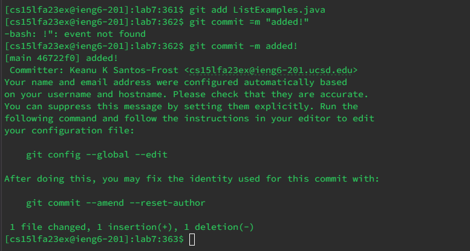

**Step 4 and 5**


For this step, I logged onto ieng6 and used the 
```
git clone git@github.com:ksantosfrost/lab7.git
```
command to clone the github repository using ssh. 

**Step 6**


For this step, I used the
```
ls
```
command to find the lab7 directory. I then used the 
```
cd lab7
```
command to change the directory to lab7. I then used the 
```
ls
```
command again to find the file I need to run to run the tests. I then used 
```
bash test.sh
```
to run the tests. I then got the output of the test showing that there was one failure. 

**Step 7**


For this step I used the 
```
vim ListExamples.java
```
command to edit the Java file. I went down to the line that had the error. The error was that it said 
```
index1 += 1
```
instead of 
```
index2 += 1; 
```
I changed that, pressed <Escape> then typed in :wq to save and exit the file. 

**Step 8**


For this step, I used the 
```
bash test.sh
```
command to run the bash file again. The output of the tests was then showed in the terminal. It passed the test. 

**Step 9**


For this step I used 
```
git add ListExamples.java
```
to add the correction to the repository. I then used 
```
git commit -m added!
```
to add the message to the commit, finishing the last step of the lab!
