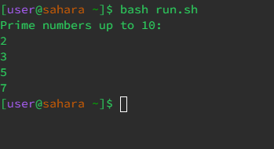
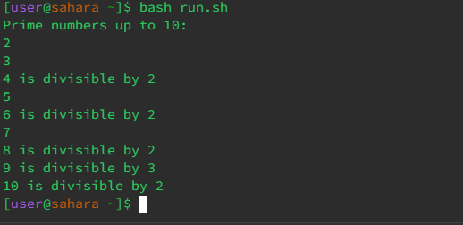

**Student's Question*
Hi all,

I'm working on a Java program to list all prime numbers up to a given number. However, I'm getting some unexpected non-prime numbers in my output. For instance, when I input 10, the output does not include 9, which is prime. I think the bug might be in my loop or the prime-checking condition, but I'm not sure. Here's a screenshot of the output.

```
java
public class PrimeCalculator {

    public static void main(String[] args) {
        int limit = 10; // Limit up to which to find prime numbers
        System.out.println("Prime numbers up to " + limit + ":");

        for (int number = 2; number <= limit; number++) {
            if (isPrime(number)) {
                System.out.println(number);
            }
        }
    }

    public static boolean isPrime(int number) {
        if (number == 2) {
            return true;
        }
        for (int i = 2; i <= number / 2; i++) {
            if (number % i == 0) {
                return false;
            }
        }
        return true; // Bug: Incorrectly returns true for non-prime numbers
    }
}

```



**TA's response**
Hi,

It sounds like there might be an issue with your prime-checking logic. Could you add a print statement inside your prime-checking loop to show the factors of each number as it's being checked? This might help us identify where the logic is going wrong.

Best,
TA

Thanks for the suggestion, TA! I added the print statements, and here's what I found. It looks like my program is not correctly identifying non-prime numbers. For example, it's not correctly identifying 9 as a non-prime. Here's the updated code and the output I got.

**Updated Code:**
```java
public static boolean isPrime(int number) {
    for (int i = 2; i < number; i++) {
        if (number % i == 0) {
            System.out.println(number + " is divisible by " + i);
            return false;
        }
    }
    return true;
}


Lab Reflection:

The coolest thing I learned was how to use the vim command. I already knew about nano, which is simpler, but vim turned out to be really interesting. Vim lets you do a lot of stuff quickly just using the keyboard, without needing a mouse. This can make working on code or editing text much faster once you get used to it.

What's cool about vim is all the different keyboard shortcuts it has. For example, you can use dd to delete a line, yy to copy a line, and p to paste it somewhere else. These shortcuts make changing text super quick and easy. Jumping to the start or end of a file is simple too. At first, vim seemed a bit tricky, but after some practice, it's actually really handy and fun to use.


